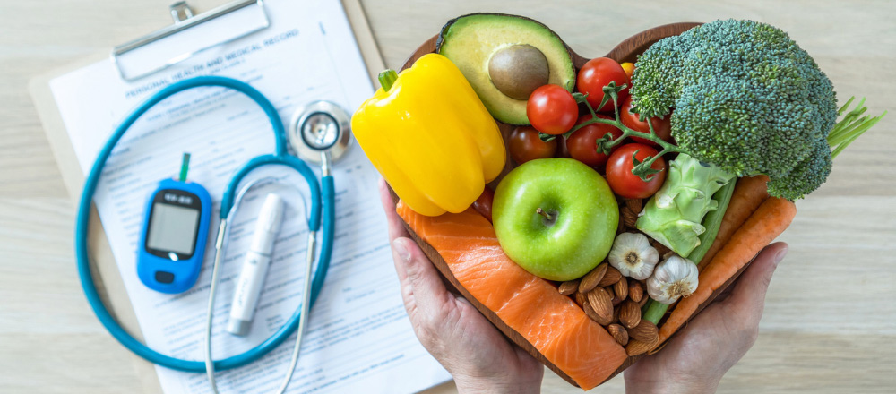

# Diyabet Tahmin Uygulaması 🩺

<p align="center">
  
</p>

Bu proje, **diyabet riskini tahmin etmek** için geliştirilmiş bir **Streamlit tabanlı web uygulamasıdır**. Random Forest modeli kullanılarak eğitilen bu uygulama, kullanıcıların sağlık bilgilerini girerek diyabet risklerini öğrenmelerini sağlar. Proje, [Pima Indian kadınlarından toplanan tıbbi veriler](https://www.kaggle.com/datasets/uciml/pima-indians-diabetes-database) ile (%95.50 doğruluk oranıyla) eğitilmiştir ve [TÜRKDIAB Diyabet Tanı ve Tedavi Rehberi 2024](https://www.turkdiab.org)'ten alınan önerilerle desteklenmiştir.

## 📋 Proje Özeti

Bu uygulama, bireylerin diyabet riskini değerlendirmelerine yardımcı olmak amacıyla geliştirilmiştir. Kullanıcılar, sağlık bilgilerini girerek diyabet risklerini öğrenebilir ve TÜRKDIAB Rehberi'ne dayalı öneriler alabilir. Uygulama, aşağıdaki sağlık bilgilerini kullanarak diyabet riskini tahmin eder:

- Gebelik Sayısı  
- Glukoz Seviyesi  
- Kan Basıncı  
- Triceps Deri Kalınlığı (obeziteyle ilişkili bir ölçüm)  
- İnsülin Seviyesi  
- Vücut Kitle İndeksi (BMI)  
- Diyabet Öyküsü (ailede diyabet varlığı)  
- Yaş  

## 🧠 Veri Seti ve Değişiklikler

Projemiz, [Pima Indian Diyabet Veri Seti](https://www.kaggle.com/datasets/uciml/pima-indians-diabetes-database)'ni temel almıştır. Orijinal veri seti aşağıdaki sütunlardan oluşur:

| Özellik | Açıklama |
|--------|----------|
| `Pregnancies` | Gebelik sayısı |
| `Glucose` | 2 saatlik oral glikoz tolerans testindeki plazma glukoz seviyesi (mg/dL) |
| `BloodPressure` | Diyastolik kan basıncı (mmHg) |
| `SkinThickness` | Triceps deri kalınlığı (mm) |
| `Insulin` | 2 saatlik serum insülin seviyesi (µU/mL) |
| `BMI` | Vücut kitle indeksi (kg/m²) |
| `DiabetesPedigreeFunction` | Genetik yatkınlık skoru |
| `Age` | Yaş (yıl) |
| `Outcome` | Diyabet durumu (0: Diyabetsiz, 1: Diyabetli) |

### 🛠️ Veri Ön İşleme

- **Değişken isimleri güncellendi:**  
  - `DiabetesPedigreeFunction` → `Diyabet_Oykusu` (0: Ailede yok, 1: Ailede var)
- **Eksik ve sıfır değerler temizlendi:**  
  - Glukoz, insülin ve BMI'deki sıfır değerler medyanla dolduruldu.
- **Tıbbi aralıklara göre sınırlama yapıldı:**  
  - Glukoz: 70-200 mg/dL  
  - İnsülin: 16-166 µU/mL  
  - BMI: 18.5-45 kg/m²  
  - Yaş: 21-70 yıl
- **Veri ölçeklendirme:**  
  - `RobustScaler` ile aykırı değerlere karşı daha dayanıklı hale getirildi.
- **Veri Dengesi:**  
  - Dengeli bir train-test ayrımı yapıldı çünkü veri seti başlangıçta dengesizdi.

## 📊 Model ve Eğitim Süreci

Modelimizi eğitmek için Random Forest algoritmasını tercih ettik. Random Forest, hem yüksek doğruluk sunması hem de özellik önem sıralamasını sağlaması açısından uygun bir seçimdir. Eğitim sürecinde şu adımları izledik:

- Veri seti %80 eğitim ve %20 test olarak ayrıldı.
- Hiperparametre optimizasyonu (GridSearchCV) ile en iyi parametreler bulundu:
  - `max_depth`: 8
  - `max_features`: 5
  - `min_samples_split`: 5
  - `n_estimators`: 100
- Model, bu parametrelerle eğitildi ve %95.50 doğruluk oranı elde edildi.
- Özellik önem sıralaması yapılarak hangi özelliklerin daha belirleyici olduğu analiz edildi.

### Model Performansı

- **Test Seti Doğruluğu**: 0.9550
- **Diyabetsiz (Precision/Recall/F1)**: 0.97 / 0.94 / 0.95
- **Diyabetli (Precision/Recall/F1)**: 0.94 / 0.97 / 0.96

Bu metrikler, modelin hem diyabetli hem de diyabetsiz sınıfları yüksek doğrulukla tahmin ettiğini gösterir.

## 🌟 Özellikler

- **Kullanıcı Dostu Arayüz**: Streamlit ile geliştirilen uygulama, kullanıcıların sağlık bilgilerini kolayca girebileceği geniş bir form sunar.
- **Yüksek Doğruluk**: Random Forest modeli, %95.50 doğruluk oranıyla diyabet riskini tahmin eder.
- **Tıbbi Öneriler**: TÜRKDIAB Diyabet Tanı ve Tedavi Rehberi 2024'e dayalı öneriler sunar.
- **Özellik Önemi**: Modelin hangi özelliklere daha fazla önem verdiği, sıralı bir grafikle gösterilir.
- **Güvenli Girdi Kontrolü**: Tıbbi aralıklarla sınırlandırılmış girişler sayesinde hatalı veri girişi önlenir.

## 🛠️ Kurulum

### Gereksinimler
- Python 3.8 veya üstü
- Gerekli Python kütüphaneleri: `streamlit`, `pandas`, `joblib`, `matplotlib`, `seaborn`, `scikit-learn`

### Kurulum Adımları
1. Bu depoyu klonlayın:
   ```
   git clone https://github.com/BlackRazor34/Diyabet_Tahmin_Projesi.git
   cd diyabet-tahmin-uygulamasi
   ```

2. Gerekli kütüphaneleri yükleyin:
   ```
   pip install streamlit pandas joblib matplotlib seaborn scikit-learn
   ```

3. Uygulamayı başlatın:
   ```
   streamlit run streamlit_app.py
   ```

## 📖 Kullanım

<p align="center">
  
</p>

1. Uygulamayı başlattıktan sonra sol tarafta yer alan formu doldurun.
2. Gebelik sayısı, glukoz seviyesi, kan basıncı, triceps deri kalınlığı, insülin seviyesi, BMI, diyabet öyküsü ve yaş bilgilerinizi girin.
3. "Tahmin Yap" butonuna tıklayın.
4. Tahmin sonucunuzu ve olasılıklarınızı sağ tarafta göreceksiniz. Diyabet riski tespit edilirse, TÜRKDIAB Rehberi'ne dayalı öneriler sunulacaktır.
5. Özellik önem grafiği, hangi sağlık özelliklerinin tahmin için daha önemli olduğunu gösterir.

## ⚠️ Önemli Notlar

- Bu uygulama bir tanı aracı değildir. Tahmin sonuçlarınızı bir doktorla değerlendirin.
- Daha fazla bilgi için [TÜRKDIAB Diyabet Tanı ve Tedavi Rehberi 2024](https://www.turkdiab.org) dökümanını inceleyebilirsiniz.
- Triceps deri kalınlığı, obeziteyle doğrudan ilişkilidir ve diyabet riskini değerlendirmede önemli bir ölçüttür.

## 📜 Lisans

Bu proje, MIT Lisansı altında lisanslanmıştır. Ayrıntılar için [LICENSE](LICENSE) dosyasını inceleyebilirsiniz.

## 📬 İletişim

Proje ile ilgili sorularınız veya önerileriniz için [GitHub Issues](https://github.com/kullaniciadi/diyabet-tahmin-uygulamasi/issues) üzerinden iletişime geçebilirsiniz.

---

Bu proje, diyabet farkındalığını artırmak ve bireylerin sağlık durumlarını değerlendirmelerine yardımcı olmak için geliştirilmiştir. 🚀